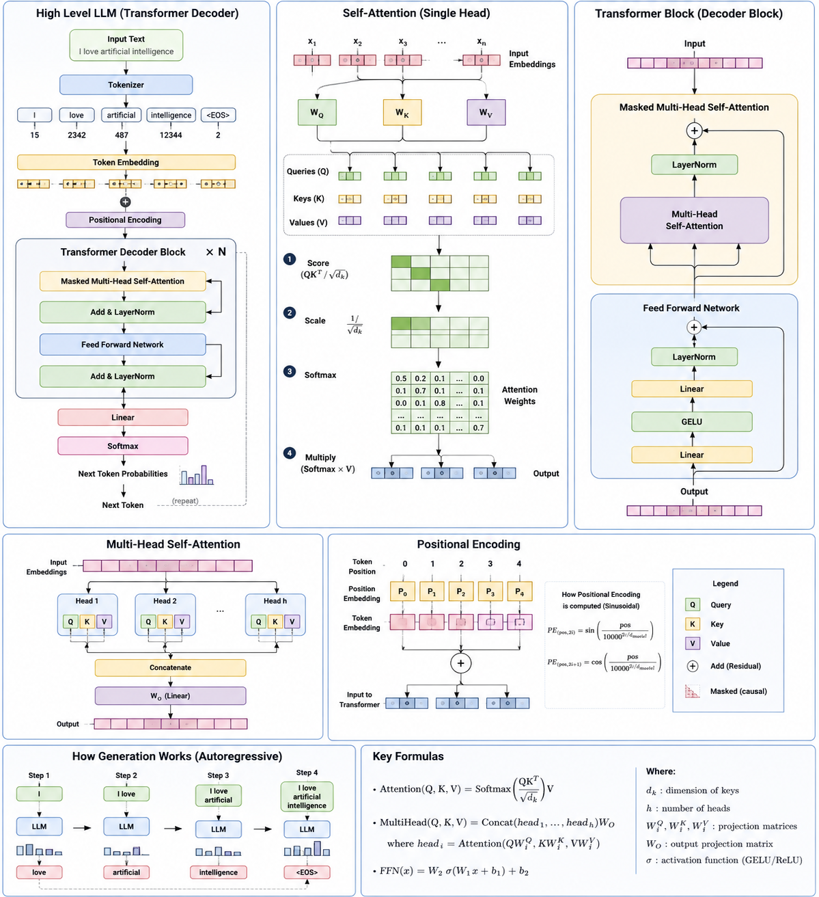
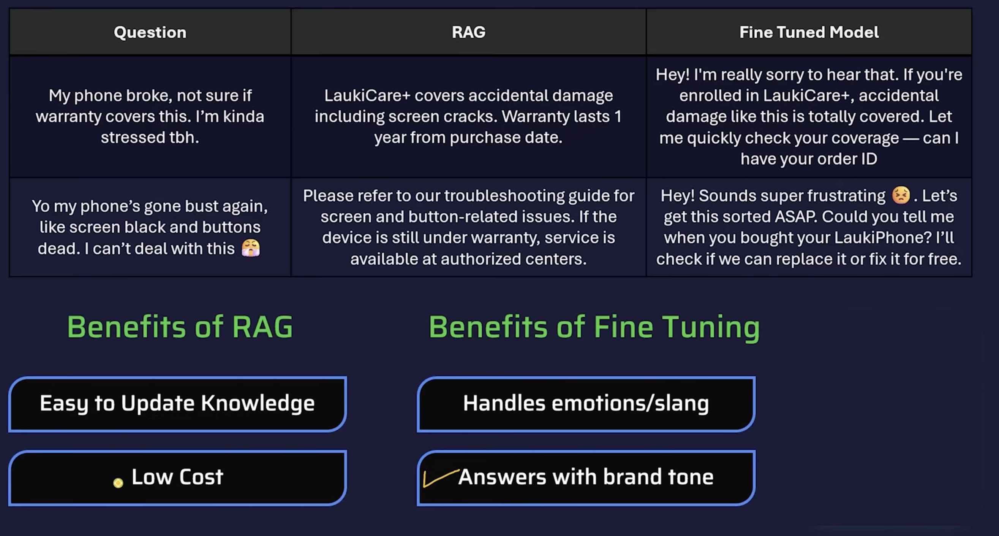

# GEN AI & LangChain & LangGraph & Deep Agents ([Link](./Deep-Agents.md)) (via Example Learning)

> Last updated: June 2026 
#### covered some testcases using vitest
 
## 🧠 Also covers RAG VS Fine Tuning topic (Theory) ([Detailed](./fine-tune-rag.md))

- Types of fine tuning are Full fine tuning and Parameter Efficient Fine tuning(PEFT) (⑆ Lora and QLora)
- Parameter Efficient Fine tuning methods Lora and QLora
    -  PEFT (LoRA)
        ```text
        PEFT (LoRA) Keep the original model frozen and train only a small adapter.
        W′ = W + ΔW

        Where:
            W = Original weights (do not change)
            ΔW = Small trainable adapter
            W' = Final weights used during inference

            Think of it as:

            New Model = Original Model + Small Update

            Example 1
            =========

            Original model:

            1,000,000 parameters

            PEFT trains:

            10,000 parameters

            So:

            ❌ Full Fine-Tuning → 1,000,000 parameters
            ✅ PEFT → 10,000 parameters

            Example 2
            =========
            Original model: 
            7 billion parameters

            PEFT trains:
            20–100 million parameters (depends on the LoRA configuration)

            The remaining 6.9+ billion parameters stay unchanged.

            🏆 One-line Formula to Remember
               New Model = Original Model + Small Adapter

               Or mathematically:
               W′ =W+ΔW

               This is the key formula behind LoRA-based PEFT and is the one most commonly asked about in interviews.
- RAG is slower than Fine-Tuning" refers to inference (runtime) latency, not the overall system.
- RAG + Fine-Tuning = ❤️

## Common LLM Parameters ([LLM Detained Link](./LLM-params.md))

| Parameter           | Description                                              | Typical Range  | Default         |
| ------------------- | -------------------------------------------------------- | -------------- | --------------- |
| `temperature`       | Controls randomness                                      | 0.0 – 2.0      | 1.0             |
| `top_p`             | Nucleus sampling                                         | 0.0 – 1.0      | 1.0             |
| `max_tokens`        | Maximum output tokens                                    | Model limit    | Varies          |
| `stop`              | Stops generation at specific strings                     | String / Array | None            |
| `seed`              | Makes output reproducible                                | Integer        | Random          |
| `presence_penalty`  | Encourages new topics                                    | -2.0 – 2.0     | 0               |
| `frequency_penalty` | Reduces repeated words                                   | -2.0 – 2.0     | 0               |
| `top_k`             | Samples from top K tokens (not supported by every model) | 1 – 100+       | Model dependent |
| `n`                 | Number of completions to generate                        | 1+             | 1               |
| `stream`            | Stream tokens as they're generated                       | true / false   | false           |
| `response_format`   | Control output format                                    | text / JSON    | text            |

---

## Embedding Models Comparison (Open Source → Paid)

### Open Source Embedding Models

| Model | Organization | Dimensions | Max Context | Multilingual | Best Use Case |
|--------|--------------|-----------:|------------:|:------------:|---------------|
| all-MiniLM-L6-v2 | Sentence Transformers | **384** | 256–512 | ❌ | Lightweight semantic search |
| all-MiniLM-L12-v2 | Sentence Transformers | **384** | 256–512 | ❌ | Better accuracy than L6 |
| all-mpnet-base-v2 | Sentence Transformers | **768** | 512 | ❌ | High-quality sentence embeddings |
| BGE-small-en-v1.5 | BAAI | **384** | 512 | ❌ | Fast RAG |
| BGE-base-en-v1.5 | BAAI | **768** | 512 | ❌ | General RAG |
| BGE-large-en-v1.5 | BAAI | **1024** | 512 | ❌ | High-quality retrieval |
| bge-m3 | BAAI | **1024** | 8192 | ✅ | Long-context multilingual RAG |
| e5-small-v2 | Microsoft | **384** | 512 | ✅ | Lightweight retrieval |
| e5-base-v2 | Microsoft | **768** | 512 | ✅ | Balanced performance |
| e5-large-v2 | Microsoft | **1024** | 512 | ✅ | Better semantic search |
| gte-small | Alibaba | **384** | 512 | ❌ | Fast embeddings |
| gte-base | Alibaba | **768** | 512 | ❌ | General-purpose search |
| gte-large | Alibaba | **1024** | 512 | ❌ | Enterprise retrieval |
| Nomic Embed Text v1 | Nomic AI | **768** | 8192 | ✅ | Long documents |
| Snowflake Arctic Embed | Snowflake | **1024** | 8192 | ✅ | Enterprise RAG |
| jina-embeddings-v3 | Jina AI | **1024** | 8192 | ✅ | Multilingual search |
| Qwen3 Embedding | Alibaba | **1024** | 32768 | ✅ | Long-context multilingual applications |

---

# Commercial / Paid API Models

| Model | Company | Dimensions | Max Context | Best Use Case |
|--------|---------|-----------:|------------:|---------------|
| text-embedding-3-small | OpenAI | **1536** | 8192 | Cost-effective RAG |
| text-embedding-3-large | OpenAI | **3072** | 8192 | Highest OpenAI retrieval quality |
| embed-english-v3.0 | Cohere | **1024** | 512 | English semantic search |
| embed-multilingual-v3.0 | Cohere | **1024** | 512 | 100+ languages |
| voyage-3-lite | Voyage AI | **512** | 32000 | Fast retrieval |
| voyage-3 | Voyage AI | **1024** | 32000 | State-of-the-art retrieval |
| voyage-code-3 | Voyage AI | **1024** | 32000 | Code search |

---

# Dimension Comparison

| Dimensions | Typical Models | Storage | Speed | Retrieval Quality |
|------------:|---------------|---------|-------|-------------------|
| **384** | MiniLM, BGE-small, E5-small | Very Low | ⭐⭐⭐⭐⭐ | Good |
| **512** | Voyage-3-lite | Low | ⭐⭐⭐⭐ | Good |
| **768** | MPNet, E5-base, GTE-base, Nomic | Medium | ⭐⭐⭐⭐ | Very Good |
| **1024** | BGE-large, E5-large, Jina, Cohere, Voyage | High | ⭐⭐⭐ | Excellent |
| **1536** | OpenAI text-embedding-3-small | Higher | ⭐⭐⭐ | Excellent |
| **3072** | OpenAI text-embedding-3-large | Highest | ⭐⭐ | Best (OpenAI) |

---

# Storage Requirement

Assuming **float32 (4 bytes/value)**.

| Dimensions | Size per Embedding |
|------------:|-------------------:|
| 384 | ~1.5 KB |
| 512 | ~2 KB |
| 768 | ~3 KB |
| 1024 | ~4 KB |
| 1536 | ~6 KB |
| 3072 | ~12 KB |

Example:

- 1 million embeddings (384 dimensions) ≈ **1.5 GB**
- 1 million embeddings (1536 dimensions) ≈ **6 GB**
- 1 million embeddings (3072 dimensions) ≈ **12 GB**

---

# Which Model Should You Choose?

## Small Projects

| Requirement | Recommendation |
|------------|----------------|
| Local RAG | BGE-small |
| Fast semantic search | MiniLM-L6 |
| Low memory | E5-small |

---

## Medium Projects

| Requirement | Recommendation |
|------------|----------------|
| Production RAG | BGE-base |
| General search | MPNet |
| Multilingual | E5-base |

---

## Enterprise

| Requirement | Recommendation |
|------------|----------------|
| High accuracy | BGE-large |
| Long documents | Jina v3 |
| Enterprise knowledge base | Snowflake Arctic |

---

## Best API Models

| Requirement | Recommendation |
|------------|----------------|
| Lowest cost | OpenAI text-embedding-3-small |
| Best overall | OpenAI text-embedding-3-large |
| Best multilingual | Cohere Multilingual |
| Best retrieval benchmark | Voyage-3 |

---

# Performance Ranking (Approximate)

| Rank | Model |
|-----:|-------|
| 🥇 | Voyage-3 |
| 🥈 | OpenAI text-embedding-3-large |
| 🥉 | BGE-M3 |
| 4 | Jina Embeddings v3 |
| 5 | BGE-large |
| 6 | E5-large |
| 7 | Snowflake Arctic |
| 8 | MPNet |
| 9 | BGE-base |
| 10 | MiniLM |

---

# Quick Recommendations

| Scenario | Recommended Model |
|----------|-------------------|
| Learning embeddings | all-MiniLM-L6-v2 |
| Free local RAG | BGE-base-en-v1.5 |
| Best open-source | BGE-M3 |
| Multilingual RAG | Jina Embeddings v3 |
| Long-context documents | Qwen3 Embedding |
| Best paid API | text-embedding-3-large |
| Best price/performance | text-embedding-3-small |
| Code search | Voyage Code-3 |

---

# Important Notes

- Higher dimensions **do not automatically mean better quality**.
- Embeddings from different models are **not compatible** with each other.
- Always use the **same embedding model** for:
  - Document embeddings
  - Query embeddings
- If you change embedding models, **re-embed all stored documents** before querying.
- For production RAG systems, retrieval quality depends on:
  1. Embedding model
  2. Chunking strategy
  3. Vector database
  4. Similarity metric
  5. Reranking model

# Reranker Models Comparison (Open Source → Paid)

## What is a Reranker?

A **reranker** is a model that **re-scores retrieved documents** after the vector database returns the Top-K results.

Instead of comparing embeddings, it reads both the **query** and the **document together** and predicts how relevant the document is.

Typical RAG pipeline:

```text
User Query
      │
      ▼
Embedding Model
      │
      ▼
Vector Database
      │
      ▼
Top 20 Documents
      │
      ▼
Reranker
      │
      ▼
Top 5 Documents
      │
      ▼
LLM
      │
      ▼
Answer
```

---

# Embedding vs Reranker

| Embedding Model | Reranker |
|-----------------|----------|
| Converts text into vectors | Reads query + document together |
| Fast | Slower |
| Used for retrieval | Used for ranking |
| ANN Search | Cross Encoder |
| Millions of documents | Tens or hundreds of documents |
| One forward pass | One forward pass per query-document pair |
| Approximate similarity | Precise relevance |

---

# Open Source Rerankers

| Model | Organization | Parameters | Context | Best Use Case |
|--------|--------------|-----------:|--------:|---------------|
| bge-reranker-base | BAAI | 278M | 512 | General RAG |
| bge-reranker-large | BAAI | 560M | 512 | High-quality retrieval |
| bge-reranker-v2-m3 | BAAI | 568M | 8192 | Multilingual RAG |
| bge-reranker-v2-gemma | BAAI | 2B | 8192 | Long-context reranking |
| ms-marco-MiniLM-L6-v2 | Sentence Transformers | 22M | 512 | Lightweight reranking |
| ms-marco-MiniLM-L12-v2 | Sentence Transformers | 33M | 512 | Better accuracy |
| cross-encoder/ms-marco-MiniLM-L6-v2 | Sentence Transformers | 22M | 512 | Fast reranking |
| cross-encoder/ms-marco-MiniLM-L12-v2 | Sentence Transformers | 33M | 512 | Better semantic ranking |
| cross-encoder/ms-marco-electra-base | Sentence Transformers | 110M | 512 | Higher accuracy |
| jina-reranker-v2-base | Jina AI | ~300M | 8192 | Long-context RAG |
| jina-reranker-v2 | Jina AI | ~500M | 8192 | Enterprise retrieval |
| Qwen3 Reranker | Alibaba | Varies | 32768 | Long-context multilingual |

---

# Commercial / API Rerankers

| Model | Company | Context | Best Use Case |
|--------|---------|--------:|---------------|
| rerank-v3.5 | Cohere | 4096 | General-purpose reranking |
| rerank-multilingual-v3.0 | Cohere | 4096 | 100+ languages |
| rerank-v3 | Cohere | 4096 | Production RAG |
| rerank-2 | Voyage AI | 32000 | State-of-the-art retrieval |
| rerank-2-lite | Voyage AI | 32000 | Lower latency |
| Voyage Contextual Reranker | Voyage AI | 32000 | Long-document ranking |

---

# Model Size Comparison

| Model | Parameters |
|--------|-----------:|
| MiniLM-L6 | 22M |
| MiniLM-L12 | 33M |
| Electra Base | 110M |
| BGE Base | 278M |
| Jina Base | ~300M |
| BGE Large | 560M |
| BGE M3 | 568M |
| Gemma Reranker | 2B |

---

# Speed Comparison

| Model | Speed |
|--------|-------|
| MiniLM-L6 | ⭐⭐⭐⭐⭐ |
| MiniLM-L12 | ⭐⭐⭐⭐ |
| Electra | ⭐⭐⭐ |
| BGE Base | ⭐⭐⭐ |
| BGE Large | ⭐⭐ |
| Jina | ⭐⭐ |
| Gemma | ⭐ |

---

# Accuracy Comparison

| Model | Accuracy |
|--------|----------|
| Gemma Reranker | ⭐⭐⭐⭐⭐ |
| Voyage Rerank-2 | ⭐⭐⭐⭐⭐ |
| Cohere Rerank-v3.5 | ⭐⭐⭐⭐⭐ |
| BGE Reranker v2 M3 | ⭐⭐⭐⭐☆ |
| Jina Reranker v2 | ⭐⭐⭐⭐☆ |
| BGE Large | ⭐⭐⭐⭐ |
| Electra | ⭐⭐⭐⭐ |
| MiniLM-L12 | ⭐⭐⭐ |
| MiniLM-L6 | ⭐⭐ |

---

# Memory Requirements (Approximate)

| Model | RAM / VRAM |
|--------|-----------:|
| MiniLM-L6 | ~100 MB |
| MiniLM-L12 | ~150 MB |
| Electra | ~450 MB |
| BGE Base | ~1 GB |
| BGE Large | ~2 GB |
| Jina | ~2 GB |
| Gemma | 6–10 GB |

---

# Typical RAG Pipeline

```text
Documents
     │
     ▼
Chunking
     │
     ▼
Embedding Model
     │
     ▼
Vector Database
     │
     ▼
Top 20 Chunks
     │
     ▼
Reranker
     │
     ▼
Top 5 Chunks
     │
     ▼
LLM
     │
     ▼
Answer
```

---

# When Should You Use a Reranker?

Use a reranker if:

- You want higher retrieval accuracy.
- Your RAG system retrieves irrelevant chunks.
- You search millions of documents.
- You're building a production chatbot.
- You're building enterprise search.
- You're building legal, medical, or finance RAG systems.

Skip the reranker if:

- You have fewer than ~1,000 documents.
- Latency is more important than accuracy.
- You're building a prototype or MVP.

---

# Embedding + Reranker Pairing

| Embedding Model | Recommended Reranker |
|-----------------|----------------------|
| BGE-small | BGE-reranker-base |
| BGE-base | BGE-reranker-large |
| BGE-M3 | BGE-reranker-v2-m3 |
| E5-large | Cohere Rerank v3.5 |
| Jina Embeddings | Jina Reranker v2 |
| OpenAI text-embedding-3-small | Cohere Rerank v3.5 |
| OpenAI text-embedding-3-large | Voyage Rerank-2 |
| Voyage Embeddings | Voyage Rerank-2 |

---

# Approximate Performance Ranking

| Rank | Model |
|-----:|-------|
| 🥇 | Voyage Rerank-2 |
| 🥈 | Cohere Rerank-v3.5 |
| 🥉 | BGE-reranker-v2-Gemma |
| 4 | BGE-reranker-v2-M3 |
| 5 | Jina Reranker v2 |
| 6 | BGE-reranker-large |
| 7 | Electra Cross Encoder |
| 8 | MiniLM-L12 |
| 9 | MiniLM-L6 |

---

# Recommendations

| Scenario | Recommended Reranker |
|----------|----------------------|
| Learning | MiniLM-L6 |
| Fast local RAG | BGE-reranker-base |
| Best open source | BGE-reranker-v2-M3 |
| Long-context RAG | Jina Reranker v2 |
| Enterprise RAG | BGE-reranker-large |
| Highest API quality | Voyage Rerank-2 |
| Best multilingual | Cohere Rerank Multilingual |
| Best price/performance | Cohere Rerank-v3.5 |

---

# Key Points

- A reranker **does not replace** an embedding model.
- Retrieval is typically **Embedding → Vector Database → Reranker → LLM**.
- Rerankers are **cross-encoders**, meaning they process the query and document together.
- They are significantly **more accurate** than cosine similarity but also **slower**.
- A common production setup retrieves **Top 20–100** candidates using embeddings, then reranks them and passes only the **Top 3–10** to the LLM.
- Rerankers improve ranking quality but **do not generate embeddings** and **cannot perform vector search**.

----
----
## Transformer Self Attention All You Need (research paper)

```Attention Is All You Need (Research Paper - 2017)
                     │
                     ▼
Introduced the Transformer Architecture
                     │
                     ▼
Uses Self-Attention Mechanism inside the Transformer 
                     │
                     ▼
Modern LLMs (GPT, Llama, Gemini, DeepSeek, Qwen, Mistral)


Hierarchy
=========
Attention Is All You Need (Paper)
            │
            ▼
Transformer (Architecture)
            │
            ├── Self-Attention
            ├── Multi-Head Attention
            ├── Feed Forward Network
            ├── LayerNorm
            ├── Residual Connection
            └── Positional Encoding
                     │
                     ▼
              Modern LLMs

The algorithm is the Self-Attention mechanism.
```



# ✅ Completed
## RAG

# How it works — 3 phases

```text
INDEXING (runs once)          RETRIEVAL + GENERATION (runs per query)
──────────────────            ──────────────────────────────────────
Load URL / PDF / CSV          User asks question
        ↓                            ↓
Load documents                Agent calls retrieve()
        ↓                            ↓
Split into chunks             similaritySearch() → Top 3 chunks
        ↓                            ↓
Create embeddings             Retrieve relevant chunks
        ↓                            ↓
Store in Vector Store         LLM gets:
                              • User question
                              • Retrieved chunks
                                      ↓
                                Generate answer
```

---

# Swap out pieces as needed

| Part             | Current                          | Alternatives                                                 |
| ---------------- | -------------------------------- | ------------------------------------------------------------ |
| **Loader**       | `CheerioWebBaseLoader`           | `WebBaseLoader`, `PDFLoader`, `CSVLoader`, `DirectoryLoader` |
| **Splitter**     | `RecursiveCharacterTextSplitter` | `TokenTextSplitter`, `MarkdownTextSplitter`                  |
| **Embeddings**   | `text-embedding-3-small`         | `text-embedding-3-large`, `Cohere`, `Mistral`, `Ollama`      |
| **Vector Store** | `MemoryVectorStore`              | `Chroma`, `FAISS`, `Pinecone`, `PGVector`, `Qdrant`          |
| **Retriever**    | `similaritySearch()`             | `asRetriever()`, `MMR Retriever`, `MultiQueryRetriever`      |
| **Model**        | `gpt-4.1-mini`                   | Any `createAgent()` compatible model                         |

---

# Simple Flow

```text
                INDEXING (One Time)

Website / PDF / CSV
         │
         ▼
     Document Loader
         │
         ▼
    Split into Chunks
         │
         ▼
  Create Embeddings
         │
         ▼
    Vector Database


────────────────────────────────────────────


      RETRIEVAL + GENERATION (Every Query)

      User Question
            │
            ▼
        retrieve()
            │
            ▼
   similaritySearch()
            │
            ▼
   Top K Relevant Chunks
            │
            ▼
 Question + Retrieved Chunks
            │
            ▼
            LLM
            │
            ▼
       Final Answer
```

### 🛡️ Guardrails
- `piiMiddleware` — single middleware instance with `types[]` and `customDetectors`
- `safetyGuardrailMiddleware` — custom `createMiddleware` with `afterModel` hook
- Content filtering and blocking unsafe responses with `jumpTo: "end"`
- Middleware naming rules — each middleware can only be registered once
- Middleware list - https://reference.langchain.com/python/deepagents/middleware

### 🔗 LangChain (v1)
- `createAgent` — new API replacing deprecated `createReactAgent` from LangGraph
- `systemPrompt` — renamed from `prompt`
- `tool()` — from `@langchain/core/tools`
- `piiMiddleware` — unified rules object with regex patterns (`/g` flag required)
- `createMiddleware` — custom middleware with lifecycle hooks:
  - `beforeAgent` / `afterAgent`
  - `beforeModel` / `afterModel` → `{ canJumpTo, hook }` shape
  - `wrapModelCall` / `wrapToolCall`
- `AIMessage`, `HumanMessage` imports from `langchain`
- dotenv setup for ESM — `import "dotenv/config"` as first line

### 🧠 LangGraph (v1)
- `StateGraph` — manual graph construction with `addNode`, `addEdge`
- `Annotation.Root` — custom state schema definition
- `messagesStateReducer` — reducer for message state
- `MemorySaver` — in-memory checkpointer for multi-turn conversations
- `createReactAgent` — still required for swarm/supervisor (known compatibility issue)
- Version pinning — `@langchain/langgraph ^1.3.1+` required for SwarmState compatibility

### 👔 LangGraph Supervisor (`@langchain/langgraph-supervisor`)
- `createSupervisor` — orchestrates multiple agents with a supervisor LLM
- Agent name alignment — supervisor prompt must reference exact agent `name` values
- `llm` + `prompt` + `agents[]` config
- Compiling with `workflow.compile({ checkpointer })`

### 🐝 LangGraph Swarm (`@langchain/langgraph-swarm`)
- `createSwarm` — high-level swarm builder (requires `createReactAgent`, not `createAgent`)
- `createHandoffTool` — handoff between agents by name
- `SwarmState` — built-in state schema with `messages` + `activeAgent` keys
- `addActiveAgentRouter` — manual swarm wiring with `StateGraph`
- Multi-turn memory via `MemorySaver` checkpointer on `workflow.compile()`
- Known bug: `createAgent` (LangChain v1) incompatible with `langgraph-swarm` — use `createReactAgent` ([issue #1739](https://github.com/langchain-ai/langgraphjs/issues/1739))

### 💾 Long-Term Memory
- `MemorySaver` — short-term, in-process memory (lost on restart)
- `thread_id` in `configurable` — scopes memory to a conversation thread
- Multi-turn invocation pattern — same `config` object passed across turns

---

## 🔲 To Cover

### ✳️ LangGraph Checkpoint Validation (`langgraph-checkpoint-validation`)
- Validating checkpoint schemas
- Custom checkpoint validators
- Error handling for invalid state transitions

### ✳️ `@langchain/react`
- React bindings for LangChain agents
- Streaming responses in UI
- Integrating agent state with React component state
- `useAgent` / `useLangGraph` hooks (if available)

### ✳️ @langchain/langgraph-checkpoint-postgres (long term memory and chekpointer)

### ✳️ langgraph-checkpoint-mongodb (long term memory and chekpointer)

### ✳️ @langchain/langgraph-checkpoint-redis (long term memory and chekpointer)

### ✳️ @langchain/langgraph-checkpoint-sqlite (long term memory and chekpointer)

---
## MCP ([Detailed](./mcp.md))
-  MCP (Model Context Protocol) like MCP = USB-C for AI applications.
-  MCP (Model Context Protocol) is a standard protocol that lets AI models securely connect to external tools, data sources, and services using a common interface.
- MCP (Model Context Protocol) types - 1️⃣ MCP Host, 2️⃣ MCP Client, 3️⃣ MCP Server
- ✳️ 1️⃣ MCP Host - The application that uses MCP 🕵Eg. Claude Desktop, Cursor, VS Code, ChatGPT (future integrations)
- ✳️ 2️⃣ MCP Client - Connects the host to one or more MCP servers 🕵Eg. Requests available tools, resources, and prompts
- ✳️ 3️⃣ MCP Host - Exposes tools, resources, and prompts to the client 🕵Eg. Filesystem Server, GitHub Server, PostgreSQL Server

```
                MCP Architecture

+----------------+
|    MCP Host    |
| (Claude/Cursor)|
+-------+--------+
        |
        |
+-------v--------+
|   MCP Client   |
+-------+--------+
        |
        |
+-------v------------------------------+
|             MCP Server               |
|                                      |
|  • Tools                             |
|  • Resources                         |
|  • Prompts                           |
+--------------------------------------+
```


### ✳️ MCP Server (Completed)
- MCP Server - 1️⃣ Tools (Functions the AI can execute Eg. Run SQL, Call API), 2️⃣ Resources (Data the AI can read Eg. Documents, Database rows, Logs), 3️⃣ Prompts (Reusable prompt templates Eg. Code review, SQL generation)
- Setting up a Model Context Protocol server
- Exposing tools and resources over MCP
- Transport options — `stdio`, `sse (Server-Sent Events)`, `http`, `Streamable HTTP`
- Tool schema definition for MCP
- Connecting MCP server to LangGraph agents

### ✳️ MCP Client (Completed)
- An MCP Client is the component that communicates with an MCP Server on behalf of the AI application.
- Connecting to an MCP server from LangChain/LangGraph
- `MultiServerMCPClient` — managing multiple MCP server connections
- Loading MCP tools into a LangGraph agent
- Authentication and session management
- Error handling and reconnection strategies

---

## 📦 Package Reference

| Package | Version | Notes |
|---|---|---|
| `langchain` | `^1.x` | `createAgent`, `createMiddleware`, `piiMiddleware` |
| `@langchain/core` | `^1.1.44+` | `tool`, `BaseMessage`, `AIMessage` |
| `@langchain/openai` | latest | `ChatOpenAI` |
| `@langchain/langgraph` | `^1.3.1+` | `StateGraph`, `MemorySaver`, `createReactAgent` |
| `@langchain/langgraph-swarm` | `^1.0.2` | `createSwarm`, `SwarmState`, `createHandoffTool` |
| `@langchain/langgraph-supervisor` | latest | `createSupervisor` |
| `@modelcontextprotocol/sdk/server/mcp.js` | latest | `create MCP Server` |
| `@modelcontextprotocol/sdk/client/index.js` | latest | `create MCP client` |
| `dotenv` | latest | Use `import "dotenv/config"` in ESM |

---

## ⚠️ Gotchas & Key Lessons

- **`createAgent` vs `createReactAgent`** — `createAgent` is v1, but swarm/supervisor still need `createReactAgent`
- **Tool return types must be strings** — wrap with `String(...)` to avoid type errors
- **Middleware registered once** — can't use the same middleware class twice; combine rules into one instance
- **dotenv in ESM** — `import "dotenv/config"` must be the absolute first import
- **`SwarmState` version mismatch** — upgrade all `@langchain/*` packages together with `pnpm add ... @latest`
- **Supervisor prompt must use exact agent names** — `math_expert` not `math_agent`
- **`afterModel` hook shape** — must be `afterModel: { canJumpTo: [...], hook: async (state) => {} }`
- **Tool-call guard in safety middleware** — skip `jumpTo: "end"` if `lastMessage.tool_calls?.length > 0`
##
# RAG VS Fine Tuning


# RAG vs Fine-Tuning

## What are they?

| RAG                                          | Fine-Tuning                                 |
| -------------------------------------------- | ------------------------------------------- |
| Gives the LLM external knowledge at runtime. | Changes the LLM's weights through training. |
| No retraining required.                      | Requires retraining the model.              |
| Best for dynamic data.                       | Best for changing model behavior or style.  |

---

# High-Level Architecture

```text
RAG

User Question
      │
      ▼
Retrieve Relevant Documents
      │
      ▼
Question + Context
      │
      ▼
LLM
      │
      ▼
Answer
```

```text
Fine-Tuning

Training Data
      │
      ▼
Train Model
      │
      ▼
Fine-Tuned Model
      │
      ▼
User Question
      │
      ▼
Answer
```

---

# How They Work

## RAG

```text
Documents
      │
      ▼
Split into Chunks
      │
      ▼
Create Embeddings
      │
      ▼
Vector Store
      │
──────────────────────────────
      │
User Question
      │
      ▼
Similarity Search
      │
      ▼
Top Chunks
      │
      ▼
LLM
      │
      ▼
Answer
```

---

## Fine-Tuning

```text
Training Dataset
      │
      ▼
Train Model
      │
      ▼
Update Model Weights
      │
      ▼
Save Fine-Tuned Model
      │
──────────────────────────────
      │
User Question
      │
      ▼
Fine-Tuned Model
      │
      ▼
Answer
```

---

# Comparison

| Feature                    | RAG                        | Fine-Tuning        |
| -------------------------- | -------------------------- | ------------------ |
| Updates knowledge          | ✅ Easy                     | ❌ Retrain required |
| Uses external documents    | ✅ Yes                      | ❌ No               |
| Changes model behavior     | ❌ No                       | ✅ Yes              |
| Cost                       | Low                        | High               |
| Speed to update            | Minutes                    | Hours/Days         |
| Hallucination reduction    | High (with good retrieval) | Limited            |
| Needs Vector DB            | ✅ Yes                      | ❌ No               |
| Needs Training Data        | ❌ No                       | ✅ Yes              |
| Best for company documents | ✅ Yes                      | ❌ No               |
| Best for writing style     | ❌ No                       | ✅ Yes              |

---

# When to Use RAG

Use RAG when:

* Company knowledge base
* PDF search
* Website chatbot
* Internal documentation
* Product manuals
* FAQs
* Frequently changing information

Example:

```text
Question:
What is our leave policy?

↓

Retrieve HR Policy PDF

↓

LLM answers using the latest policy.
```

---

# When to Use Fine-Tuning

Use Fine-Tuning when:

* Custom writing style
* Domain-specific vocabulary
* Consistent response format
* Classification tasks
* Code generation style
* Brand voice

Example:

```text
Train with:

Question:
Write a support reply.

↓

Model always responds in your company's tone.
```

---

# Real-World Examples

| Problem                                   | Solution      |
| ----------------------------------------- | ------------- |
| Chat with PDFs                            | ✅ RAG         |
| Company documentation assistant           | ✅ RAG         |
| Customer support bot with latest policies | ✅ RAG         |
| Medical research search                   | ✅ RAG         |
| Financial reports Q&A                     | ✅ RAG         |
| Brand-specific writing style              | ✅ Fine-Tuning |
| SQL generation in a fixed format          | ✅ Fine-Tuning |
| Email generation with company tone        | ✅ Fine-Tuning |

---

# Can They Be Used Together?

Yes. This is common in production.

```text
User Question
      │
      ▼
Retrieve Company Documents (RAG)
      │
      ▼
Fine-Tuned LLM
      │
      ▼
Answer
```

* **RAG** provides up-to-date knowledge.
* **Fine-Tuning** provides the desired behavior and response style.

---

# Simple Rule to Remember

```text
Need latest information?
        │
        └──► Use RAG

Need to change how the model behaves?
        │
        └──► Use Fine-Tuning

Need both?
        │
        └──► Combine RAG + Fine-Tuning
```

---

# One-Line Difference

```text
RAG         = Give the model external knowledge before answering.

Fine-Tuning = Teach the model new behavior by training it.
```
